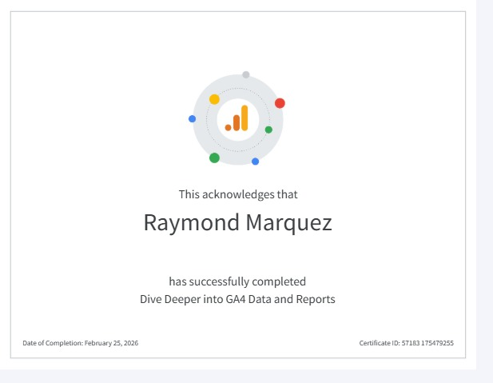

::: {.column-page}

::: {.text-center .mb-5}
{.img-fluid .shadow-lg .rounded-3}
:::

### Certification Details

- **Candidate:** Raymond Marquez
- **Course:** Dive Deeper into GA4 Data and Reports
- **Completion Date:** February 25, 2026
- **Certificate ID:** 57183 175479255

### Overview

This specialized course focuses on the deep-dive analysis capabilities within GA4. It covers exploratory analysis, custom reporting, and the ability to extract meaningful business stories from complex datasets. The certification confirms a mastery of the reporting interface and the analytical tools necessary for detailed performance tracking.

[Back to Certifications](certifications.qmd){.btn .btn-outline-primary}

:::
