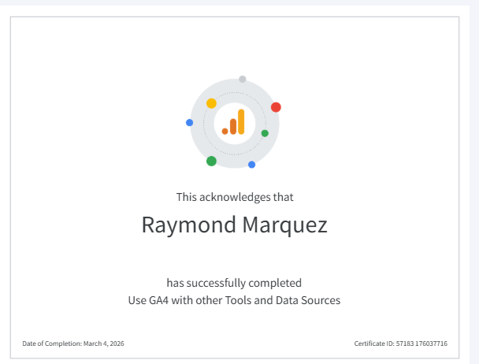

::: {.column-page}

::: {.text-center .mb-5}
{.img-fluid .shadow-lg .rounded-3}
:::

### Certification Details

- **Candidate:** Raymond Marquez
- **Course:** Use GA4 with other Tools and Data Sources
- **Completion Date:** March 4, 2026
- **Certificate ID:** 57183 176037716

### Overview

This certification validates proficiency in integrating Google Analytics 4 with external data sources and diverse marketing tools. It covers advanced tracking implementations, data import strategies, and the cross-platform analytical workflows required for comprehensive digital marketing strategy.

[Back to Certifications](certifications.qmd){.btn .btn-outline-primary}

:::
