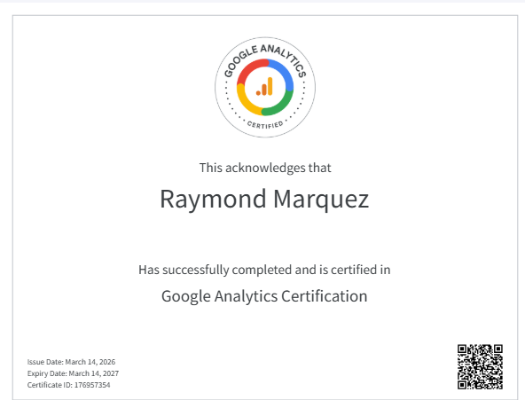

::: {.column-page}

::: {.text-center .mb-5}
{.img-fluid .shadow-lg .rounded-3}
:::

### Certification Details

- **Candidate:** Raymond Marquez
- **Certification:** Google Analytics Certification
- **Issue Date:** March 14, 2026
- **Expiry Date:** March 14, 2027
- **Certificate ID:** 176957354

### Overview

The Google Analytics Certification demonstrates an advanced understanding of the GA4 platform. It covers everything from basic setup and data collection to advanced audience segmentation, conversion tracking, and strategic report analysis. This credential signifies a high level of expertise in the industry-standard tool for digital analytics.

[Back to Certifications](certifications.qmd){.btn .btn-outline-primary}

:::
